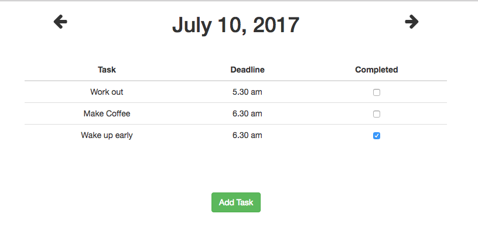
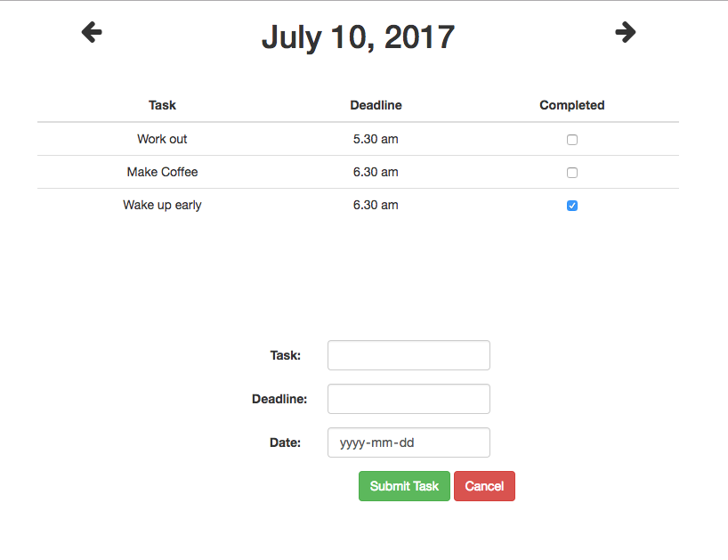

#Task Manager 

A Full-stack web application using postgres to manage your 3 most important tasks in the day

1. Back-End: Node.js, Express

2. Front-End: Aurelia, JQuery, Lodash and Moment

3. Database: Postgresql

